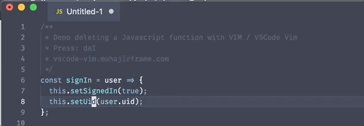
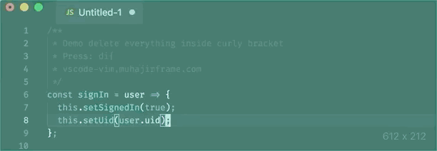
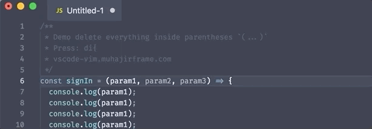
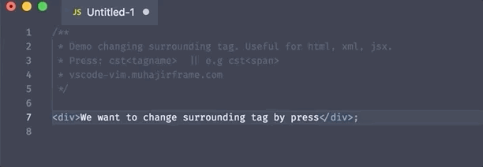
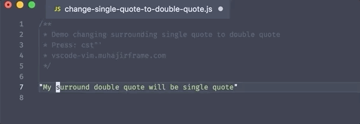

# vscode-vim-tips

This repo contains useful Tips and trick for VSCode and VIM.
If you have something you want to contribute do not hesitate to submit a pull request or submit an issue

### Deleting a function

Press `daI`

### Delete everything inside curly bracket `{..}`

press `di{`

### Delete everything inside parentheses

### Change Surrounding Tag

### change single quote to double quote

