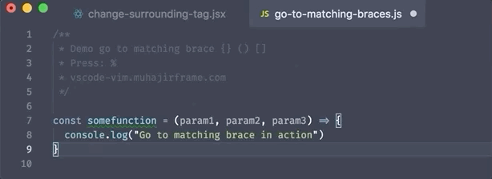
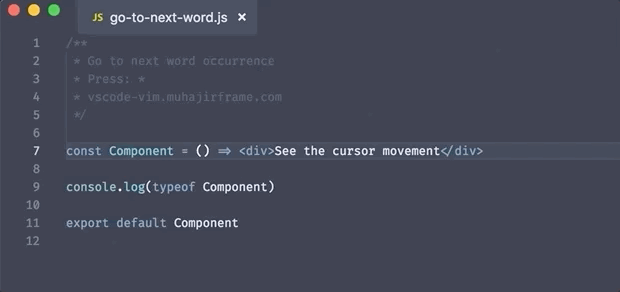

# VSCode + Vim Tips and Trick for Daily Use

This repo contains useful Tips and trick for VSCode and VIM.
If you have something you want to contribute do not hesitate to submit a pull request or submit an issue

### Deleting a function

### Delete everything inside curly bracket `{..}`

### Delete everything inside parentheses

### Change Surrounding Tag

### Change Single Quote to Double Quote

### Go To Matching Braces

### go to next word

